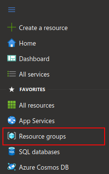
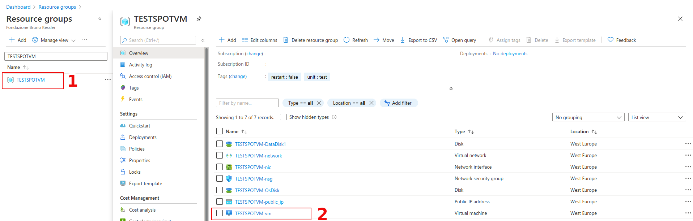
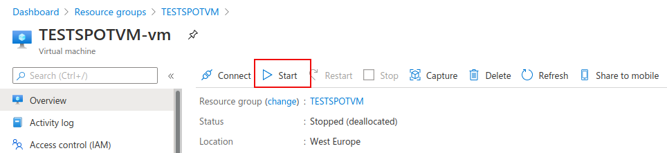
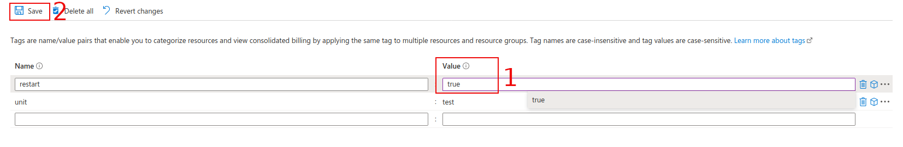
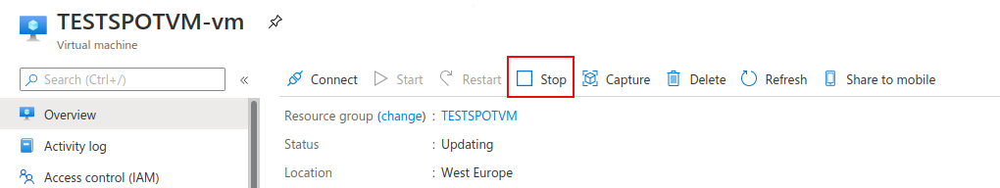
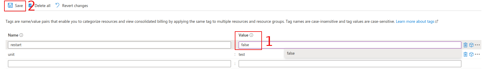

# SCL Azure Spot Instances
Using Spot VMs allows you to take advantage of Azure unused capacity at a significant cost savings. At any point in time when Azure needs the capacity back, the Azure infrastructure will evict Spot VMs. Therefore, Spot VMs are great for workloads that can handle interruptions like batch processing jobs, dev/test environments, large compute workloads, and more.

A Spot VM offers no high availability guarantees. At any point in time when Azure needs the capacity back, the Azure infrastructure will evict Spot VMs with 30 seconds notice.

To efficiently handle this problem, the checkpointing schemes are recommended. The checkpointing saves the execution status of tasks if a certain condition is met and then recovers the task status from the last saved point upon a failure.

In this project we provide:
1. Manifest to create VMs using Terraform.
2. Manifest to configure VMs using Ansible.
3. Monitoring system capable of reporting the status of the VM through a slack channel.
4. Script that tries to restart the machine once every hour if it has been deallocated by azure.

### Create VM using Terraform and Ansible

TO DO

### How to use SCL Azure Spot Instances
#### Start Spot VM
1. Sign in to the Azure portal at https://portal.azure.com.

2. From the main menu on the left side, select Resource Group

  

3. From the list of resource groups, select your **Resource Group**, and select the **VM**.

  

4. Select the **Start** button on the overview page for your virtual machine.

  

5. From the menu on the left side, select **Tags** and change restart tag from **false** to **true**.

  

#### Stop Spot VM

1. Select the Stop button on the overview page for your virtual machine.

  

2. From the menu on the left side, select Tags and change restart tag from **true** to **false** and click on **Save** button.

  

#### Slack Channel Notifications

*  User ffais@example.com requested to start **VMGPUSPOTTEST** virtual machine.

  `VM VMGPUSPOTTEST was Started by ffais@example.com`

*  The VM is ready. You can connect to the VM through your favorite SSH client.

  `VM VMGPUSPOTTEST is Ready`

*  User ffais@example.com requested to shutdown **VMGPUSPOTTEST** virtual machine.

  `VM  VMGPUSPOTTEST was Stopped by ffais@example.com`

* The VM gets evicted. You get a 30s notification before actual eviction.

  `VM VMGPUSPOTTEST will be evicted in 30s`
  
